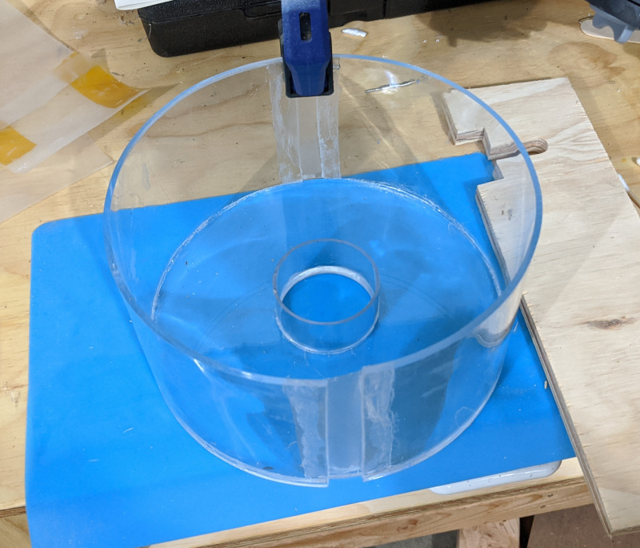
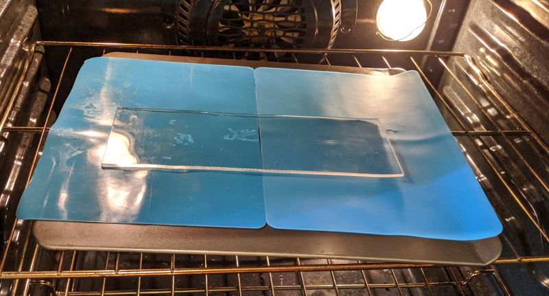

# Spin Coater

A spin coater is a piece of lab equipment used to apply a liquid as a thin 
film onto a flat surface. When I looked at spin coaters to buy, most were 
surprisingly expensive (>$1000), and the cheaper ones that I found were too
small for me. It isn't really a very complicated device, and it's fun to build things, so 
I ended up building my own.

Here I've tried to document the project, in case anyone else thinking about 
building something similar comes along and may find it helpful. 
Feel free to reproduce, or to use for inspiration in designing your 
own version.

# The Design

The needed elements are simple: 
- A motor which can maintain a controlled RPM
- A way to mount the thing-to-be-coated to the motor
- An enclosure to catch the excess fluid and catch any shrapnel if things go badly

## The Motor

The motor is a A2212 1000KV hobby quadcopter motor, like [this one](https://www.amazon.com/gp/product/B075ZSDR2T/)
. I bought this along with an ESC for $16 on amazon. These are good because they 
are readily available and cheap, but they're not reallly ideal for a spin 
coater. They are designed for fairly high speeds, and because they are 
sensorless -- using the back-EMF voltage to commutate the motor -- they have to do
an open loop startup to get up to speed and they don't work below a certain RPM.
I've found that with this controller/motor combo I can't run slower than 500RPM.

A sensored motor would be better, but I didn't find any cheap options 
for these. There are some sensored RC car motors out there apparently, but by the 
time I saw those I had this working and they aren't *that* cheap. With this setup,
there isn't any feedback on RPM from the ESC. The ESC certainly knows the speed, 
but I have no way to access it, so I had to add speed sensing anyway.

One day, maybe, I'd like to replace the ESC with a custom
motor controller using an STSPIN dev board. Since the load on the motor in this
case is pretty predictable, and I'm not very worried about power efficiency,
I think a fully open loop commutation would work fine, and would eliminate
the need for a speed sensor. At the moment though the current setup is meeting
my needs so I don't feel much pressure to put any more time into it.

## The Chuck

A good spin coater usually has a vacuum chuck, so that the item being spun can
be placed on and off easily by switching the vacuum. This is convenient, but 
it requires getting vaccum through a spinning shaft, and it requires a vacuum
pump. I opted for a simpler attachment mechanism using screws. I laser cut a 
piece of acrylic to serve as the chuck, with tapped 6-32 holes for screws. I could
put these at the right spot because I knew the size of the things I wanted to 
spin coat. It's possible to tape the substrate onto the disk as well for more
flexible mounting. Both of these prevent the coating from covering all the way
out to the edges of the substrate. This was fine for me, but if you need 100%
coverage...well the vacuum chuck starts to look pretty useful now, doesn't it?

The base (left), and chuck (right), are laser cut from 1/4 and 3/8 inch thick acrylic sheets:

It mounts to the motor shaft using a [set screw hub from servocity](https://www.servocity.com/0-125-0-770-set-screw-hub/).

For the tapped holes, I laser cut under-sized holes to mark location, and drilled them afterwards for precise hole size before tapping. 

## The Enclosure

A spin coater needs an enclosure. This is a safety concern, for sure -- nobody 
wants objects coming loose and flying off with high energy, especially not 
glass objects. But also, even when nothing goes wrong, most of the 
applied liquid is going to get flung in all directions so you need
something to contain the mess.  

Someone suggested to me that I could just put the motor in a bucket, and this 
struck me as a very sensible idea. I expect this sort of sensibility makes this
person much more productive than I am. Still though, I eschewed the bucket because
a) I wanted something prettier, b) I wanted it the size I wanted it, and c)
it's partly about the journey for this project. 

Here's a second -- probably better -- way to build an enclosure that I chose 
not to do: laser cut a square box in the classic finger joint manner. The only downside
I see is that it wil be harder to clean gunk out of the corners -- if you're
the type of person that might clean their spin coater, that is. 

Here's the most interesting thing I tried, but also probably terrible: 

It's interesting because I had never thermoformed acrylic before, but I watched 
a youtube video and I wanted to try it for myself. I'm glad I did it, but it was
kind of a lot of work and the final result wasn't great. Functional -- I actually 
used this enclosure for a few months -- but still I don't really recommend this method. 
With some practice and a better mold -- more work! -- it could probably get better,
but I moved on.

The bottom plate is laser-cut acylric sheet. The inner wall is a polycarbonate tube
from McMaster, and the gaps between the two molded acrylic walls is covered with 
a thin polycarbonate film. All of this is glued together with Scigrip 16 acrylic cement.

I built a very simple form out of two laser cut acrylic disks fitted onto the extra polycarb 
tube used for the inner wall. I cut an acrylic sheet to size by scoring and breaking it. 
This I placed into my oven to heat, and it comes out as a satisfyingly jiggly but solid
sheet of plastic, which can be laid over the form to cool in the right shape. 

While using the thermoformed enclosure, I acquired a 3D printer -- Covid has really increased
the value of having tools at home -- and the enclosure size I wanted 
*just* fit into the work area of the printer. It was
a 15 hour job, but hardly took any of my time. Also, it looks much better. Here's
the final product:

The whole thing *could* be 3D printed, but I already had the laser cut bottom and that
saves a lot of print time. The only part I would not want to 3D print is the chuck, 
just because of the tapped holes for the mounting screws.

The motor is mounted to a larger square acrylic base plate, and the round enclosure sits
on top of that, held in place by stick-on rubber bumbers. The bottom plate has
some tall feet to leave a bit of clearance for wires to run out underneath. This 
bottom sheet isn't really necessary; to be honest I ended up this way just 
because I already had the motor mounted to this sheet of acrylic from another 
project.

## Speed Measurement

### Phase Voltage: Tried and abandoned

The first method I used to measure RPM was tapping the voltage off of one of
the motor phases, and filtering to generate a digital signal. This actually 
worked, and I used it for a while, but it was finicky.
It had to be tuned just right, and it only worked 
reliably for a narrow motor input voltage range. Secondly, it was dependent on the 
particular ESC waveform; when I tried it with a different ESC it didn't work 
at all, and at that point I threw it out and dug into my parts drawers for an optical sensor.

### Optical Encoder: Time tested, tinkerer approved

For take two of the speed sensor, I setup a QRD1114 reflective sensor next to the motor, and mounted a half-dark, half-bright disk underneath the chuck. A 3D printed mount holds the 
sensor in place. The sensor is hot-glued into the mounting bracket, and the 
bracket is attached to the baseplate with 3M LSE300 pressure sensitive adhesive. 
The black and white disk is just cut from a sheet of thin (0.2mm) G10 I had around, with some paper glued on, but could be made of anything with enough rigidity
to hold itself up. Or you could just glue a piece of paper to the chuck.

This repo includes the 3D models for the bracket as [STEP](3dmodels/SensorBracket.step) or [STL](3dmodels/SensorBracket.stl)

Controller
----------

The controller is based on an STM32 microcontroller with a touchscreen. All it needs to do is 
measure the spindle speed and adjust the PWM output to the ESC to regulate 
to the desired speed.

It uses the [Tapper](https://github.com/mcbridejc/tapper) board, with just
a few resistors and a trim pot added to adjust the photodiode sensitivity 
on the speed sensor.

The software for the controller can be found at https://github.com/mcbridejc/spincoater-controller.

## Parts List

| Name           | Supplier     | Part Number | Description |
| ---------------| ------------ | ----------- | ----------- |
| Base               | Tap Plastics | N/A         | 10x10x0.25" acrylic from the scrap bin |
| Inner Wall         | McMaster     | 8585K29     | Polycarb tube 2-1/4" OD, 1/8" thick |
| Rubber Bumpers     | McMaster     | 95495K57    | Clear bumpers with adhesive |
| Motor Hub          | Servocity    | 545540      | 0.77" Set Screw Hub with 1/8" bore ([link](https://www.servocity.com/0-125-0-770-set-screw-hub/)) |
| Reflectance sensor | Digikey      | QRD1114     | LED and Phototransistor in leaded package |
| Motor              | Amazon       | A2212/13T   | 1000kV, 14 pole pair brushless motor |
| Thermoformed walls |  | N/A | 1/8" acrylic sheet, cut to size, and molded |
| Enclosure bottom   |  | N/A | 1/8" acrylic sheet, laser cut |
| Chuck Disk         |  | N/A | 3/8" acrylic sheet, laser cut |
